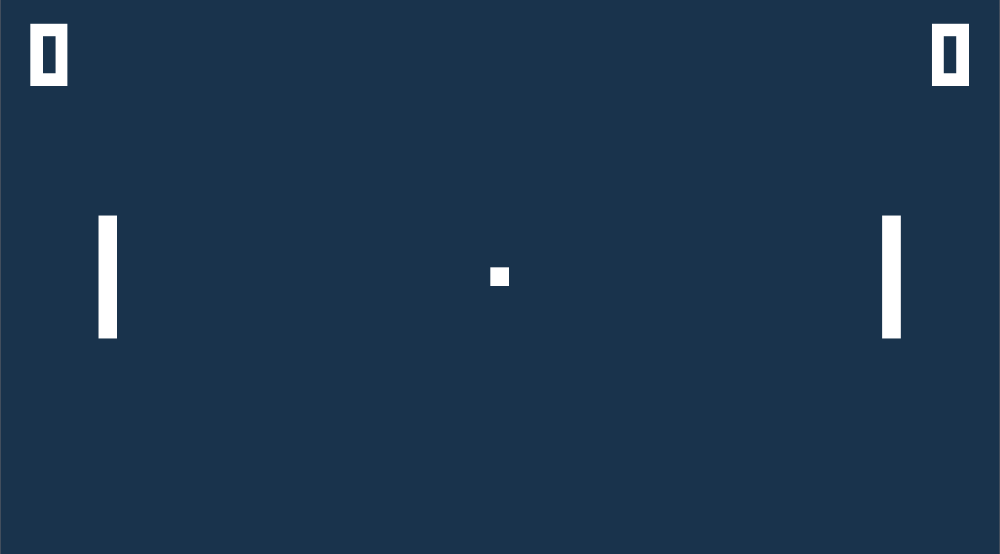

# 🏓 Pong

A modern, cross-platform Pong clone written in C++ using OpenGL and GLFW.



---

## 🚀 Features

* ⚡ Fast and lightweight
* 🎮 Simple keyboard controls
* 🎨 ImGui-based debug UI
* 🖼️ Digit-based score rendering
* 🧹 Clean component structure
* 📆 Cross-platform builds for Windows, Linux, and macOS

---

## 👨‍🛠 Build Instructions

### ❗ Requirements

* CMake (≥ 3.16)
* C++23-capable compiler (MSVC, Clang, or GCC)
* Git (for submodule cloning)

### 📆 Dependencies

Bundled as submodules:

* [GLFW](https://github.com/glfw/glfw)
* [Glad](https://github.com/Dav1dde/glad)
* [ImGui](https://github.com/ocornut/imgui)
* [GLM](https://github.com/g-truc/glm)

---

### 🧰 Build (Linux / macOS)

```bash
git clone --recursive https://github.com/TasinFarhanMC/pong
cd pong
cmake -B build -DCMAKE_BUILD_TYPE=Release
cmake --build build
````

### 🧰 Build (Windows, MSVC)

Use CMake GUI or:

```bash
cmake -B build -G "Visual Studio 17 2022" -A x64
cmake --build build --config Release
```

> 📂 Output binaries will be placed in `bin/`.

---

## 🎮 Controls

| Key     | Action            |
| ------- | ----------------- |
| `W / S` | Move left paddle  |
| `↑ / ↓` | Move right paddle |
| `P`     | Pause / Unpause   |
| `R`     | Reload Shaders    |
| `Enter` | Start             |
| `ESC`   | Exit              |

---

## 📁 Assets

Assets (fonts, shaders, textures) are located in the `assets/` folder and must be next to the binary.

---

## 📦 Prebuilt Releases

Download prebuilt versions:

Released:

* 🔗 [Linux Standalone x64](https://nightly.link/TasinFarhanMC/pong/workflows/ci.yaml/release/binaries-ubuntu-latest-clang.zip)
* 🔗 [Windows Standalone x64](https://nightly.link/TasinFarhanMC/pong/workflows/ci.yaml/release/binaries-windows-latest-cl.zip)

InDev:

* 🔗 [Linux Standalone x64](https://nightly.link/TasinFarhanMC/pong/workflows/ci.yaml/main/binaries-ubuntu-latest-clang.zip)
* 🔗 [Windows Standalone x64](https://nightly.link/TasinFarhanMC/pong/workflows/ci.yaml/main/binaries-windows-latest-cl.zip)

---

## 🧪 Development

Enable ImGui debug overlay and tweak game constants in `src/`.

---

## 📄 License

MIT License © 2025 [Tasin Farhan](https://github.com/TasinFarhanMC)
